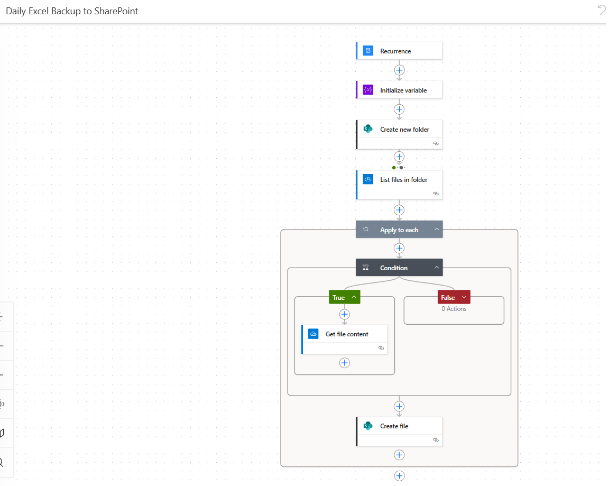
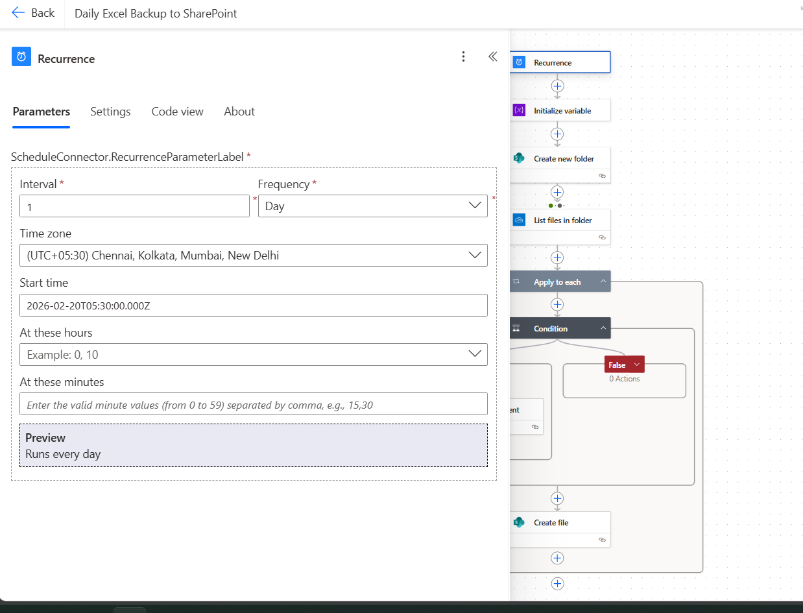

# 📁 Power Automate — OneDrive Daily Backup Flow

## 🔍 Problem It Solves
Every day, 5 files in an OneDrive folder get updated with new data.
Previously this backup had to be done **manually** — opening OneDrive,
creating a date folder, copying all files one by one.

This Power Automate flow **automates the entire process** — it runs 
daily, creates a date-wise folder automatically, and copies all 5 files.

---

## ⚙️ How the Flow Works

**Trigger:** Scheduled — runs automatically every day at a set time

**Steps:**
1. Flow is triggered on schedule
2. Gets current date and formats it as YYYY-MM-DD
3. Creates a new folder inside `/Backup/` with today's date as the name
4. Copies all 5 files from the source folder into the new date folder

**Result:** Every day a new folder like `2026-02-19` is created automatically
with copies of all 5 files — zero manual effort.

---

## 🛠️ Tools Used
- Microsoft Power Automate
- Microsoft OneDrive
- SharePoint File Actions

---

## 📸 Flow Screenshots

### Full Flow Overview


### Scheduled Trigger


### Create Date Folder Step


### Copy Files Step


---

## 🐍 Python Equivalent (Local Version)
The file `backup_script.py` contains a Python script that replicates 
the same logic locally — useful for understanding the underlying logic
or running outside of Power Automate.

---

## 💡 What I Learned
- Scheduling automated flows in Power Automate
- Working with OneDrive and SharePoint file actions
- Dynamic folder naming using date expressions
- Replacing repetitive manual tasks with automation
```
